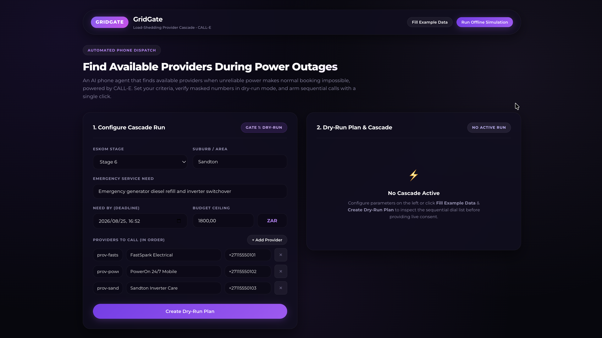
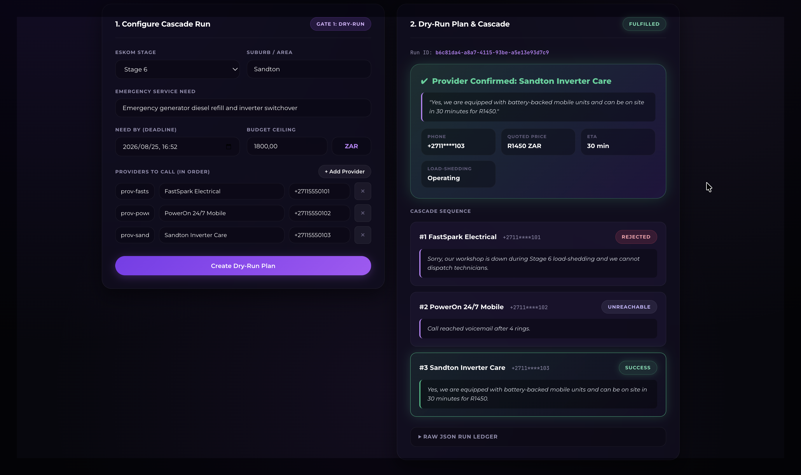

# GridGate

An experimental local developer workbench and reference prototype for AI phone agent cascades when unreliable power makes normal booking impossible, powered by [CALL-E](https://www.heycall-e.com/).





GridGate calls providers one at a time when outages make it unclear who is still operating. You set a deadline, budget, and list of numbers. GridGate uses CALL-E to place the calls, stops at the first provider that can help, and returns structured results you can act on. Dry-run mode is on by default; live calls require an explicit second step.

Built for the [CALL-E: Your Code Is Calling](https://call-e.devpost.com/) hackathon.

> **Scope & Prototype Notice:** GridGate is an experimental, local-only developer reference workbench built for evaluation and demonstration. In this prototype stage, execution, stream, cancellation, and actuator endpoints are unauthenticated, webhook signature validation is optional for local development, and outbound calls should only be triggered with trusted credentials in local environments.

## How it works

GridGate demonstrates a consent-gated cascade pattern:
You submit a run (deadline, budget, provider list). GridGate previews the plan in local dry-run simulation by default. When explicitly armed, it calls providers sequentially via CALL-E and asks whether they can operate during the outage window. GridGate stops at the first firm confirmation within budget and returns structured quotes and spoken evidence.

## Two-Gate Safety & Consent Flow

GridGate implements consent gating and safety guardrails at the application level:

1. **Gate 1: Dry-Run Plan (`POST /api/runs`)**
   Creates a plan in `PLAN_READY` status with masked phone numbers. Places zero calls and consumes zero credits.
2. **Gate 2: Explicit Consent (`POST /api/runs/{id}/live`)**
   Requires explicit operator consent before sequential dialing begins.

Every phone call enforces:
- **AI disclosure first:** The assistant identifies as an AI within the first five seconds.
- **Phone masking:** Public endpoints mask phone numbers (`+1415****101`).
- **No auto-booking:** Never agrees to payment or binding terms on the phone.
- **Fail-closed validation:** Unclear responses are recorded as unknown without guessing.

See [docs/safety.md](docs/safety.md) and [docs/cascade.md](docs/cascade.md) for full architectural specifications.

## API Endpoints

| Method | Path | Description |
|---|---|---|
| `POST` | `/api/runs` | Create a new run (Gate 1 dry-run plan by default) |
| `GET` | `/api/runs/{id}` | Get run state, attempts, winner, and masked phone numbers |
| `GET` | `/api/runs` | List all historical and active runs |
| `POST` | `/api/runs/{id}/live` | Arm and begin sequential live dialing (Gate 2) |
| `POST` | `/api/runs/{id}/cancel` | Cancel an active run immediately |
| `POST` | `/api/runs/simulate` | Run a full offline dry-run cascade using example data |
| `GET` | `/api/runs/{id}/events` | Server-Sent Events (SSE) stream for real-time updates |
| `POST` | `/calle/webhook` | Ingestion webhook for CALL-E call completion events |

## Stack

- **Runtime:** Java 21
- **Framework:** Spring Boot 3.4 (Spring Web, Spring Data JPA, WebFlux WebClient)
- **Database:** H2 Database (persisted ledger)
- **Integration:** CALL-E REST API & Webhooks
- **Frontend:** Single-page app with Montserrat typography, glassmorphism UI, and SSE streaming

## Status

- **Phase 1 (Complete):** Domain model, cascade orchestrator, success criteria, and recipient schema mapping.
- **Phase 2 (Complete):** CALL-E WebClient integration, idempotency keys, metadata contracts, and WireMock tests.
- **Phase 3 (Complete):** REST API, H2 JPA ledger, webhook deduplication, SSE event hub, and dry-run simulation.
- **Phase 4 (Complete):** TaskPromptBuilder, single-page web UI, and architecture documentation.

## Quick Start

### 1. Run the test suite
```bash
mvn test
```

### 2. Start the local server
```bash
export CALLE_API_KEY="your_api_key" # Optional for offline simulation mode
mvn spring-boot:run
```

Open `http://localhost:8080` in your browser. Click **"Fill Example Data"** and **"Run Offline Simulation"** to explore the cascade without consuming CALL-E credits.

## Configuration

| Variable | Default | Description |
|---|---|---|
| `CALLE_API_KEY` | *(empty)* | CALL-E API authentication key |
| `CALLE_BASE_URL` | `https://api.heycall-e.com` | CALL-E API base URL |
| `GRIDGATE_WEBHOOK_URL` | `http://localhost:8080/calle/webhook` | Webhook URL passed to CALL-E |
| `GRIDGATE_DRY_RUN_DEFAULT` | `true` | Default dry-run mode for new runs |

## License

MIT
